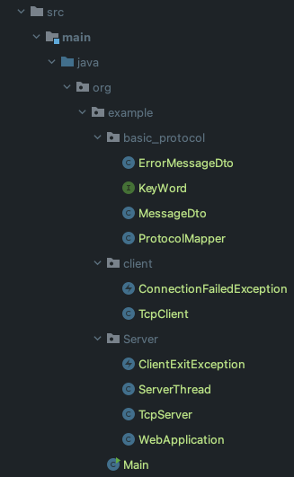

# 에코 채팅 프로토콜 응용 프로그램

이번 과제를 하며 프로토콜 설계 뿐만 아니라 아주아주 간단한 WAS를 설계해 보았다.

이 서버의 특징은 Thread Pool 을 자체적으로 생성하여 쓰레드 생성 시간을 줄이고, 요청이 오면 이를 가지고 있던 쓰레드에 배정하여,

그 쓰레드에서 WebApplication 을 돌린다.

이는 내가 자주 사용하는 Spring Boot 와 Tomcat 의 구조를 차용하여 디자인 하였다.

## 프로토콜 설명

`{Method}|{json message}` 이러한 형식이다. 앞의 메서드는 ERROR과 MESSAGE 두 가지 종류가 있다.

예시

`MESSAGE|{"from":"client","to":"server","userName":"Kate","option":1,"message":"Hello World!!"}`


## 디렉토리 구조 



## 서버 동작 설명

이 프로젝트는 간단하게 세가지 주체에 의해서 실행된다.

#### TcpServer.java

이 서버는 자체적으로 쓰레드 풀을 만들어 쓰레드 생성시간을 줄이고, 요청이 들어올 때마다 쓰레드를 배정하여, WebApplication 을 해당 쓰레드에서 실행하여 멀티쓰레드 웹 서버를 구현하였다.

```java
        //WAS 생성 - 내부적으로 쓰레드 풀을 만들어 요청하나당 하나씩 배정하고, 그 안에서 WebApplication 실행함
        TcpServer tcpServer = new TcpServer(12345,10); //쓰레드 풀 10개짜리 웹서버 생성
        tcpServer.startServerSocket(); //웹서버 시작
```
이런식으로 시작을 하게 된다. 이 이후로는 TcpServer 내부 로직에 따라 움직인다.

```java
    public void startServerSocket(){
        //서버 소켓 생성
        try (ServerSocket serverSocket = new ServerSocket(PORT_NUMBER);) {
            // 10초 마다 한번씩 인터럽트에 걸려 accept Block 에서 빠져나온다.
            serverSocket.setSoTimeout(10*1000);

            while (true){
                if (Thread.interrupted()){
                    break;
                }
                Socket socket = null;
                try {
                    socket = serverSocket.accept();//새로운 소켓 연결
                    //쓰레드 풀의 빈 쓰레드에 쓰레드 배정해서 WebApplication 실행
                    final Socket finalSocket = socket;
                    threadPool.submit(() -> {
                        WebApplication webApplication = new WebApplication();
                        webApplication.socketHandler(finalSocket); //Runtime Exception - 예상치 못한 문제 발생 가능, 기능이 다 하면 종료됨
                    });
                } catch (SocketTimeoutException e){
                } catch (IOException e){
                    if (Thread.interrupted()) break;
                }
            }
            threadPool.shutdown();
        } catch (Exception e) {
            throw new RuntimeException("소켓 생성중 예외 발생");
        } finally {
            //어떤 경우에도 쓰레드풀은 종료하고 끝낸다.
            threadPool.shutdown();
        }
        System.out.println("SYSTEM_LOG : TcpServer.java : TCP 서버 종료");
    }
```
요약 하자면, 이 객체의 역할은 serverSocket 에서 Socket을 생성해 쓰레드를 배정하고, 그 쓰레드의 WebApplication 에게 소켓을 건낸다.


### WebApplication.java

이 안에는 클라이언트로 부터의 요청을 받아 적절한 처리를 한뒤 다시 클라이언트로 보내는 로직이 포함되어있다.

서버로 받은 소켓에서 input 과 output 스트림을 추출한 뒤 이 같은 작업을 시작한다.

이 어플리케이션이 종료되는 시점은 클라이언트가 특별한 명령어를 보내면, 작업을 종료하고 쓰레드를 서버에 반납하게 된다.

이 특별한 명령어는 basic_protocol 폴더의 KeyWord 인터페이스에 명시되어있다.

```java
public interface KeyWord {
    public final static String EXIT_SIGN = "$$-exit-$$";
    public final static String EXIT_CONFIRM = "%%-EXIT_CONFIRM-$$";
```

## 유틸성 객체 설명
### MessageDto.java, ErrorMessageDto.java
Dto 는 Data Transfer Object 로 나의 프로젝트에서는 JACKSON library 를 사용하여 (Spring 의 내부처럼) 객체 <-> Json 간의 변환을 하기 때문에 필요하다.

```java
@Getter
@NoArgsConstructor(access = AccessLevel.PROTECTED)
public class MessageDto {
    private String from;
    private String to;
    private String userName;
    private int option;
    private String message;
```
이와 같은 객체를 값을 넣어 생성하고 JSON으로 변환하면
`{"from":"client","to":"server","userName":"Kate","option":1,"message":"Hello World!!"}`
이런식으로 JSON이 생성된다.

이는 거꾸로 JSON 메시지를 이 클래스의 인스턴스로 받아오는 역할도 수행하므로, 서버와 클라이언트가 서로 이 객체를 가지고 메시지를 주고 받으면, 매우 견고한 시스템이 완성된다.

### ProtocolMapper.java
내가 만든 프로토콜은 JSON만 보내는 것이 아니라 앞에 메서드 부분을 추가하여 보낸다. 이 메서드는 받는 쪽에서 어떤 객체에 매핑해야하는지, 메시지 형식이 어떻게 되는지를 판단하는 기준이된다.

따라서 이러한 작업들을 한곳에 모아 놓은 유틸성 객체가 `ProtocolMapper.java` 이다.

주요 메서드는 메시지 <-> 적절한 객체를 서로 바꿔주는 역할을 한다. 이 과정에는 프로토콜 메서드를 확인해 분기하는 과정까지 포함된다.

## Main.java , 전체적인 실행 구조

사실 클라이언트와 서버를 각각 실행시켜도 문제는 없지만, 나는 그냥 한 메서드만 실행하면, 알아서 서버를 실행하고 클라이언트를 준비 시키고 하는 것을 원했다.

따라서 나는 아래와 같은 구조를 택했다.

새로운 쓰레드를 만들어 TCP 서버를 구동하고, 그 TCP서버는 쓰레드 풀을 생성하여 서버를 돌린다. 클라이언트는 main 쓰레드에서 돌아간다.

따라서 서버와 클라이언트를 동시에 실행시킬 수 있었고, 이에 필요한 로직들도 추가하였다.

- 서버를 새로운 쓰레드에서 돌리는 로직, 그리고, 다른 쓰레드에 있는 서버를 종료하는 로직
- 서버를 종료할 때 서버 쓰레드만 종료하는 것이 아닌, 서버가 가지고 있는 쓰레드 풀 또한 종료하는 로직
- 만약 클라이언트가 종료 사인을 보냈을 경우 서버의 종료 확인 응답을 기다리고, 클라이언트 -> 서버의 쓰레드 풀 -> 서버 쓰레드 -> main 쓰레드 순서로 종료되는 로직
- 멀티쓰레드 환경이므로, 쓰레드에 안전한 설계


### Main.java
```java
public class Main {
    public static void main(String[] args) throws IOException {


        //다른 쓰레드에서 서버 생성 - 내부적으로 쓰레드 풀을 만들어 요청하나당 하나씩 배정하고, 그 안에서 WebApplication 실행함
        Thread serverThread = new ServerThread();
        serverThread.setDaemon(true); //안전하게 데몬쓰레드로
        serverThread.start();


        //클라이언트 생성
        TcpClient tcpClient = new TcpClient("localhost",12345);
        tcpClient.startChatting(10); //서버 연결 안될시 1초간격으로 10번 시도 하세요

        //서버 쓰레드에게 인터럽트를 보냅니다.
        //데몬 쓰레드 이긴 하지만, 내부에 쓰레드 풀이 있으므로, 안전하게 인터럽트를 보냅니다.
        serverThread.interrupt();

        try {
            serverThread.join(); //다 완료될때까지 main 쓰레드 대기
        } catch (InterruptedException e) {
            //다 완료됨
        }

        System.out.println("SYSTEM_LOG : Main.java : 웹서버와 클라이언트가 정상적으로 종료되었습니다.");
        //프로그램 종료
        System.out.println("SYSTEM_LOG : Main.java : 메인쓰레드 종료");
    }
}
```
ServerThread.java 는 쓰레드를 생성하여 서버를 돌리는 로직이 포함되어있는 객체이다.

main 메서드 에서는 서버 쓰레드를 생성하고 실행하였고, 데몬 쓰레드로 만들어 혹시나 오류로 프로그램이 종료되어 좀비 쓰레드가 되는 것을 방지하였다.

그리고는 클라이언트를 생성 하여 필요한 로직을 돌게 하였다. 또 멀티쓰레드 이다 보니, 순서가 보장 될 수 없기에, 서버가 연결되지 않으면, 1초에 한번씩 몇번 retry할 건지도 설정할 수 있게 해 놓았다.

그다음 클라이언트 로직이 끝나면, 서버 쓰레드가 끝나기를 기다리고 프로그램을 종료하게 된다.

### ServerThread.java

```java
public class ServerThread extends Thread{
    @Override
    public void run() {
        //WAS 생성 - 내부적으로 쓰레드 풀을 만들어 요청하나당 하나씩 배정하고, 그 안에서 WebApplication 실행함
        TcpServer tcpServer = new TcpServer(12345,10); //쓰레드 풀 10개짜리 웹서버 생성
        tcpServer.startServerSocket(); //웹서버 시작
        //서버 종료됨

        //쓰레드풀 종료되었는지 확인
        for (int i = 0; i<5;i++){
            if (tcpServer.isTerminated()) break;
            try {
                Thread.sleep(1000);
            } catch (InterruptedException e) {
            }
        }
        if (!tcpServer.isTerminated()){
            //종료 안됬으면
            tcpServer.shutDownNow();
        }
        //서버 종료
    }
}
```

이 쓰레드는 서버 쓰레드의 로직으로 웹서버를 실행 시킨다.

그리고 만약 종료가 된다면, 쓰레드 풀을 완전히 종료시키는 책임 까지 지고 있다.

### TcpClient.java
이 객체는 따로 설명할 것은 별로 없지만, 주요 로직은

```java
    private Socket attemptConnect(int retryTime) throws ConnectionFailedException {
        for (int i = 0; i < retryTime; i++) {
            try {
                return new Socket(hostName, portNumber);
            } catch (UnknownHostException ignored) {
            } catch (IOException e){
                break; //바로 ConnectionFailed
            }
            try {Thread.sleep(1000);} catch (InterruptedException e) {} //1초 대기 후 다시 시도
        }
        //만약 지정된 횟수만큼 시도했는데 안되면,
        throw new ConnectionFailedException();
    }
```
여러번 서버 연결을 시도하는 로직과

```java
                //종료사인 체크 -> 맞으면 종료
                if (option == 4){
                    out.println(protocolMapper.clientToServerMessage(new MessageDto(name,4, KeyWord.EXIT_SIGN)));
                    System.out.println("서버 측이 종료 요청을 확인할 때까지 기다려주세요.");
                    String line = null;
                    while ((line = in.readLine()) == null){
                        try {
                            Thread.sleep(300); //0.3초 마다 확인
                        } catch (InterruptedException e) {
                            break; //메시지가 왔으면
                        }
                    }
                    if (line.equals(KeyWord.EXIT_CONFIRM)){
                        System.out.println("서버 측이 연결 종료확인하였습니다. 클라이언트 채팅 프로그램을 종료합니다.");
                        System.out.println(BOUNDARY);
                        return;
                    }
                    return; //어잿든 종료
                }
```
종료할 때 그냥 종료 사인만 보내고 끝내는 게 아니라, 서버의 종료 허락을 기다리는 로직을 추가한 점이다.

이는 내가 별도의 쓰레드에서 서버를 동작시키기 때문에, 서버측의 에러가 없는 것을 확인하고 클라이언트 로직을 종료하고 싶었기 때문이다.

따라서 종료시 아래와 같은 결과가 출력된다.

```text
서버 측이 종료 요청을 확인할 때까지 기다려주세요.
WebApplication 203167809 >> receive : MESSAGE|{"from":"client","to":"server","userName":"Kate","option":4,"message":"$$-exit-$$"}
서버 측이 연결 종료확인하였습니다. 클라이언트 채팅 프로그램을 종료합니다.
===========================================================
SYSTEM_LOG : WebApplication.java 웹 애플리케이션 종료
SYSTEM_LOG : TcpServer.java : TCP 서버 종료
SYSTEM_LOG : Main.java : 웹서버와 클라이언트가 정상적으로 종료되었습니다.
SYSTEM_LOG : Main.java : 메인쓰레드 종료
```


## 실행 방법

gradle 으로 빌드 (IDE를 통하면 자동으로 빌드됨) 후 Main.java 의 main 메서드만 실행하면 됨.

## 사용한 라이브러리

JACKSON - Json 변환 도구

LOMBOK - Getter Setter 같은 코드 자동생성

## 동작 결과

서버와 같은 곳에 출력을 하기 때문에 구분하기 위해서,

서버측 Application 이 출력하는 메시지는 `WebApplication {메모리 hashcode} >>`와 같은 접두사를 붙이도록 했다.

예시 `WebApplication 203167809 >>`

```text
===========================================================
안녕하세요! 채팅 서버에 정상적으로 접속하셨습니다.
===========================================================
당신의 이름을 입력해주세요.
Kate
원하는 옵션 숫자를 입력해주세요. 옵션 = 
1 -> [에코기능] 
2 -> [소문자로 에코] 
3 -> [대문자로 에코] 
4 -> [종료]
1
원하는 메시지를 입력해주세요.
Hello World!!
===========================================================
client -> server || [Kate] : Hello World!!
WebApplication 203167809 >> receive : MESSAGE|{"from":"client","to":"server","userName":"Kate","option":1,"message":"Hello World!!"}
WebApplication 203167809 >> Before : [Kate] : Hello World!!
WebApplication 203167809 >> After : [Kate] : Hello World!!
server -> client || [Kate] : Hello World!!
===========================================================
원하는 옵션 숫자를 입력해주세요. 옵션 = 
1 -> [에코기능] 
2 -> [소문자로 에코] 
3 -> [대문자로 에코] 
4 -> [종료]
2
원하는 메시지를 입력해주세요.
Hello World!!
===========================================================
client -> server || [Kate] : Hello World!!
WebApplication 203167809 >> receive : MESSAGE|{"from":"client","to":"server","userName":"Kate","option":2,"message":"Hello World!!"}
WebApplication 203167809 >> Before : [Kate] : Hello World!!
WebApplication 203167809 >> After : [Kate] : hello world!!
server -> client || [Kate] : hello world!!
===========================================================
원하는 옵션 숫자를 입력해주세요. 옵션 = 
1 -> [에코기능] 
2 -> [소문자로 에코] 
3 -> [대문자로 에코] 
4 -> [종료]
3
원하는 메시지를 입력해주세요.
Hello World!!
===========================================================
client -> server || [Kate] : Hello World!!
WebApplication 203167809 >> receive : MESSAGE|{"from":"client","to":"server","userName":"Kate","option":3,"message":"Hello World!!"}
WebApplication 203167809 >> Before : [Kate] : Hello World!!
WebApplication 203167809 >> After : [Kate] : HELLO WORLD!!
server -> client || [Kate] : HELLO WORLD!!
===========================================================
원하는 옵션 숫자를 입력해주세요. 옵션 = 
1 -> [에코기능] 
2 -> [소문자로 에코] 
3 -> [대문자로 에코] 
4 -> [종료]
7
원하는 메시지를 입력해주세요.
Hello World!!
===========================================================
client -> server || [Kate] : Hello World!!
WebApplication 203167809 >> receive : MESSAGE|{"from":"client","to":"server","userName":"Kate","option":7,"message":"Hello World!!"}
server -> client || ErrorCode[404] : option input error: integer greater than 3
===========================================================
원하는 옵션 숫자를 입력해주세요. 옵션 = 
1 -> [에코기능] 
2 -> [소문자로 에코] 
3 -> [대문자로 에코] 
4 -> [종료]
-1
원하는 메시지를 입력해주세요.
Hello World!!
===========================================================
client -> server || [Kate] : Hello World!!
WebApplication 203167809 >> receive : MESSAGE|{"from":"client","to":"server","userName":"Kate","option":-1,"message":"Hello World!!"}
server -> client || ErrorCode[403] : option input error: integer less than 1
===========================================================
원하는 옵션 숫자를 입력해주세요. 옵션 = 
1 -> [에코기능] 
2 -> [소문자로 에코] 
3 -> [대문자로 에코] 
4 -> [종료]
문자를 입력하는 예외
숫자를 입력해주세요
4
서버 측이 종료 요청을 확인할 때까지 기다려주세요.
WebApplication 203167809 >> receive : MESSAGE|{"from":"client","to":"server","userName":"Kate","option":4,"message":"$$-exit-$$"}
서버 측이 연결 종료확인하였습니다. 클라이언트 채팅 프로그램을 종료합니다.
===========================================================
SYSTEM_LOG : WebApplication.java 웹 애플리케이션 종료
SYSTEM_LOG : TcpServer.java : TCP 서버 종료
SYSTEM_LOG : Main.java : 웹서버와 클라이언트가 정상적으로 종료되었습니다.
SYSTEM_LOG : Main.java : 메인쓰레드 종료
```